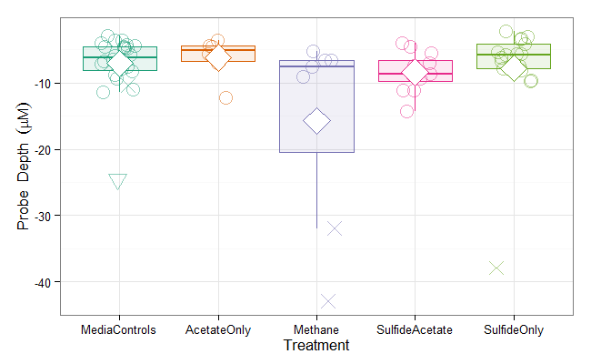
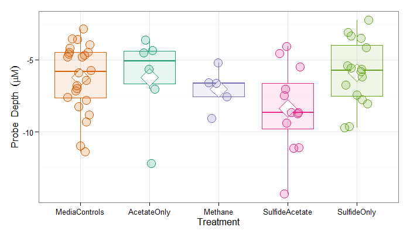

Coupon Depth
=================================================
This report summarizes the pit depths in the coupons exposed to different treatment media.

<!--  Set the working directory to the repository's base directory; this assumes the report is nested inside of only one directory.-->

```r
opts_knit$set(root.dir = "../")  #Don't combine this call with any other chunk -especially one that uses file paths.
```


<!-- Set the report-wide options, and point to the external code file. -->

```r
require(knitr)
opts_chunk$set(results = "show", comment = NA, tidy = FALSE, dpi = 100, fig.width = 6.5, 
    fig.height = 4, fig.path = "figure_raw/")
# dpi = 400 out.width = '600px', #This affects only the markdown, not the
# underlying png file.  The height will be scaled appropriately.

echoChunks <- FALSE
options(width = 120)  #So the output is 50% wider than the default.
read_chunk("./Analysis/CouponDepth.R")
```

<!-- Load the packages.  Suppress the output when loading packages. --> 


<!-- Load any Global functions and variables declared in the R file.  Suppress the output. --> 


<!-- Declare any global functions specific to a Rmd output.  Suppress the output. --> 


<!-- Load the datasets.   -->


<!-- Tweak the datasets.   -->

```

Call:
lm(formula = ProbeDepth ~ 1 + Treatment, data = dsSummary, weights = ProportionAtDepth)

Weighted Residuals:
   Min     1Q Median     3Q    Max 
-3.197 -0.458 -0.134  0.093  1.986 

Coefficients:
                        Estimate Std. Error t value Pr(>|t|)    
(Intercept)              -6.2064     0.1304  -47.59   <2e-16 ***
TreatmentAcetateOnly     -0.0155     0.2916   -0.05     0.96    
TreatmentMethane         -0.8064     0.3141   -2.57     0.01 *  
TreatmentSulfideAcetate  -2.1770     0.2259   -9.64   <2e-16 ***
TreatmentSulfideOnly      0.3084     0.2062    1.50     0.13    
---
Signif. codes:  0 '***' 0.001 '**' 0.01 '*' 0.05 '.' 0.1 ' ' 1

Residual standard error: 0.639 on 2477 degrees of freedom
Multiple R-squared:  0.0484,	Adjusted R-squared:  0.0469 
F-statistic: 31.5 on 4 and 2477 DF,  p-value: <2e-16
```


## 1. Histogram Overlay
The **first graph** represents the probe heights, as a distance from the coupon's surface.  Each curve represents a histogram.  The *y* value is the depth of the probe, while the *x* indicates how much of the coupon has pits of that depth.  Th diamonds indicate a *treatement's* mean depth. The ticks on the right side indicate a *coupon's* mean depth.

The **second graph** is almost identical to the first, but with two differences.  First, each treatment has its own facet.  Second, the standard errors are shown around each treatment mean; the means and errors were estimated with a multilevel model, shown below.

The five outlier coupons are *excluded* from these two graphs (*ie*, the four processed by Conoco-Phillips's machine, and one suspicious control coupon).  

The diamonds/means for `AcetateOnly` and `MediaControls` are on top of each other.

  


## 2. Coupon Summary Boxplot
The first boxplot shows all points; the four coupons processed on Conoco-Phillips machine are marked with an 'X'.  Another suspicious coupon (in `MediaControls`) is marked with a triangle.  The second boxplot excludes those five coupons; notice the scale of the *y*-axis has changed.

  


## 3. Estimates from MLM (multilevel model)
The five outlier coupons are *excluded* from these two graphs (*ie*, the four processed by Conoco-Phillips's machine, and one suspicious control coupon).

Model, with treatment coefficients expressed as offsets.


```
Linear mixed model fit by REML ['lmerMod']
Formula: ProbeDepth ~ 1 + Treatment + (1 | CouponID) 
   Data: dsProbe 

REML criterion at convergence: 815751 

Random effects:
 Groups   Name        Variance Std.Dev.
 CouponID (Intercept)  6.15    2.48    
 Residual             10.36    3.22    
Number of obs: 157532, groups: CouponID, 63

Fixed effects:
                        Estimate Std. Error t value
(Intercept)              -6.2063     0.5063  -12.26
TreatmentAcetateOnly     -0.0212     1.1322   -0.02
TreatmentMethane         -0.8009     1.2194   -0.66
TreatmentSulfideAcetate  -2.1753     0.8770   -2.48
TreatmentSulfideOnly      0.3103     0.8006    0.39

Correlation of Fixed Effects:
            (Intr) TrtmAO TrtmnM TrtmSA
TrtmntActtO -0.447                     
TretmntMthn -0.415  0.186              
TrtmntSlfdA -0.577  0.258  0.240       
TrtmntSlfdO -0.632  0.283  0.263  0.365
```


Model, with treatment coefficients expressed as offsets.


|id                       |  Effect|      SE|Treatment       |  CILower|  CIUpper|
|:------------------------|-------:|-------:|:---------------|--------:|--------:|
|TreatmentMediaControls   |  -6.206|  0.5063|MediaControls   |   -6.713|   -5.700|
|TreatmentAcetateOnly     |  -6.222|  1.1322|AcetateOnly     |   -7.354|   -5.090|
|TreatmentMethane         |  -7.013|  1.2194|Methane         |   -8.232|   -5.793|
|TreatmentSulfideAcetate  |  -8.383|  0.8770|SulfideAcetate  |   -9.260|   -7.506|
|TreatmentSulfideOnly     |  -5.898|  0.8006|SulfideOnly     |   -6.699|   -5.097|


## Session Information
For the sake of documentation and reproducibility, the current report was build on a system using the following software.


```
Report created by Will at 2014-02-13, 13:05:47 -0600
```

```
R Under development (unstable) (2014-02-10 r64961)
Platform: x86_64-w64-mingw32/x64 (64-bit)

locale:
[1] LC_COLLATE=English_United States.1252  LC_CTYPE=English_United States.1252    LC_MONETARY=English_United States.1252
[4] LC_NUMERIC=C                           LC_TIME=English_United States.1252    

attached base packages:
[1] stats     graphics  grDevices utils     datasets  methods   base     

other attached packages:
 [1] lme4_1.0-6      Matrix_1.1-0    lattice_0.20-24 boot_1.3-9      quantreg_5.05   SparseM_1.03    ggplot2_0.9.3.1
 [8] plyr_1.8.0.99   RODBC_1.3-10    knitr_1.5      

loaded via a namespace (and not attached):
 [1] abind_1.4-0        arm_1.6-10         coda_0.16-1        colorspace_1.2-4   dichromat_2.0-0    digest_0.6.4      
 [7] evaluate_0.5.1     formatR_0.10       grid_3.1.0         gtable_0.1.2       labeling_0.2       MASS_7.3-29       
[13] minqa_1.2.3        munsell_0.4.2      nlme_3.1-113       proto_0.3-10       RColorBrewer_1.0-5 Rcpp_0.11.0       
[19] reshape2_1.2.2     scales_0.2.3       splines_3.1.0      stringr_0.6.2      tools_3.1.0       
```

