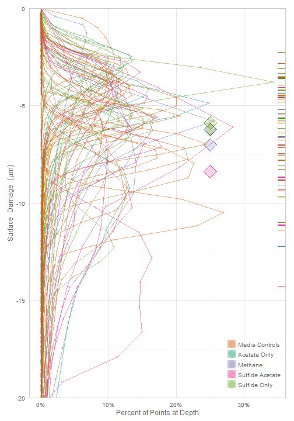
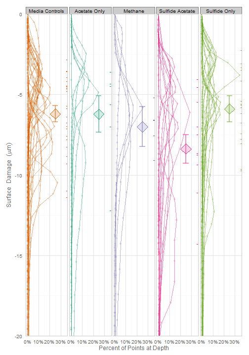
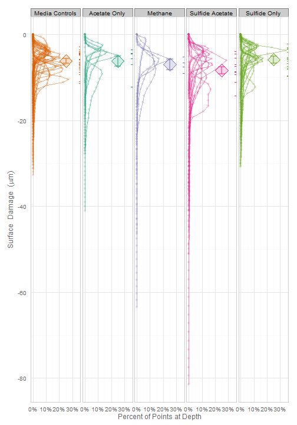

Coupon Depth
=================================================
This report summarizes the pit depths in the coupons exposed to different treatment media.

<!--  Set the working directory to the repository's base directory; this assumes the report is nested inside of only one directory. -->
<!-- Don't combine this call with any other chunk -especially one that uses file paths. -->

```r
opts_knit$set(root.dir = "../")
```


<!-- Set the report-wide options, and point to the external code file. -->

```r
require(knitr)
opts_chunk$set(
    results='show', 
    comment = NA, 
    tidy = FALSE,
#     dev = "pdf", #Uncomment this to produce pdfs for publication images (though they don't render well in the html report)
    fig.width = 7, 
    fig.height = 4, 
    fig.path = 'figure_raw/'
)
#     dpi = 400
#     out.width = "600px", #This affects only the markdown, not the underlying png file.  The height will be scaled appropriately.

echoChunks <- TRUE
options(width=180) #Widen the text output from the default of 80 characters.
read_chunk("./Analysis/CouponDepth.R") 
```

<!-- Load the packages.  Suppress the output when loading packages. --> 

```r
require(knitr) #For literate programming
require(testit) #For convenient asserts
require(RColorBrewer) #For the color palettes
require(plyr) #For manipulating datsets
require(grid) #For graphing
require(gridExtra) #For graphing
require(ggplot2) #For graphing
require(boot) #For bootstrapped CIs
require(lme4) #For multilevel modeling (MLM)
require(arm) #For manipulating MLM standard errors
require(MCMCglmm)
# require(quantreg) #For quantile regression

############################
```


<!-- Load any Global functions and variables declared in the R file.  Suppress the output. --> 

```r
pathInputSummaryBinAll <- "./Data/Derived/SummaryBinAll.rds"
pathInputProbeAll <- "./Data/Derived/ProbeAll.rds"
pathMcmcResults <-  "./Code/EstimateMlmMcmc/mcmcMlmResults.RData"
pathMcmcCode <- "./EstimateMlmMcmc/EstimateMlmMcmc.R"

bootSpread <- function( scores, weights=NULL, conf=.68 ) {
  plugin <- function( d, i ) { mean(d[i]) }  
  distribution <- boot(data=scores, plugin, weights=weights, R=99)
  
  # I'm using the percentile instead of the BCa, because the acceleration can't be estimated with these scores and weights for some reason.  I'm not using them in the real anlaysis anyway.
  ci <- boot.ci(distribution, type = c("perc"), conf=conf)
  return( ci$percent[4:5] )
}

SummarizeCorrosion <- function( d ) {  
  weightedModel <- lm(ProbeDepth ~ 1, data=d, weights=ProportionAtDepth)
  
  meanV1 <- sum(d$ProbeDepth * d$ProportionAtDepth) / sum(d$ProportionAtDepth)
  meanV2 <- coef(summary(weightedModel))["(Intercept)", "Estimate"]
  se <- coef(summary(weightedModel))["(Intercept)", "Std. Error"]  
  parametricCI <- meanV2 + c(-1, 1) * se
  
  bootCI <- bootSpread(scores=d$ProbeDepth, weights=d$ProportionAtDepth)
  data.frame(
    Top = max(d$ProbeDepth),
    Bottom = min(d$ProbeDepth),
    MeanDepth = meanV1,
    MeanDepthV2 = meanV2,
    ParametricSELower = parametricCI[1],
    ParametricSEUpper = parametricCI[2],
    BootSELower = bootCI[1],
    BootSEUpper = bootCI[2],
    BinCount = length(d$ProbeDepth)
  )
}

reportTheme <- theme_bw() +
  theme(axis.text = element_text(colour="gray40")) +
  theme(axis.title = element_text(colour="gray40")) +
  theme(panel.border = element_rect(colour="gray80")) +
  theme(axis.ticks = element_blank()) +
  theme(legend.text = element_text(colour="gray40")) +
  theme(legend.background = element_blank()) +
  theme(legend.key = element_blank()) +
  theme(legend.position=c(1,0), legend.justification=c(1,0))

############################
```


<!-- Declare any global functions specific to a Rmd output.  Suppress the output. --> 


<!-- Load the datasets.   -->

```r
dsSummaryAll <- readRDS(pathInputSummaryBinAll)
dsProbeAll <- readRDS(pathInputProbeAll)
mcmcResultsAllChains <- load(pathMcmcResults)

############################
```


<!-- Tweak the datasets.   -->

```r
###
### Syncronize factor levels with aspects of graphing.
###
#For outliers
outlierLevels <- levels(dsSummaryAll$OutlierStatus)
shapeOutlier <- c(21, 24, 25)
testit::assert("The number of `OutlierStatus` levels should equal the number of assigned shapes (for plotting)", length(outlierLevels)==length(shapeOutlier))
names(shapeOutlier) <- outlierLevels
#For treatments

treatmentLevels <- levels(dsSummaryAll$Treatment)
treatmentLabelsLine <- gsub("\\B([A-Z])", "\n\\1", treatmentLevels, perl=TRUE);
treatmentLabelsSpace <- gsub("\\B([A-Z])", " \\1", treatmentLevels, perl=TRUE);
dsSummaryAll$TreatmentPretty <- factor(dsSummaryAll$Treatment, levels=treatmentLevels, labels=treatmentLabelsSpace)

testit::assert("The number of `Treatment` levels should equal the expected number of 5 (for plotting colors)", length(treatmentLevels)==5L)
treatmentPalette <- RColorBrewer::brewer.pal(n=length(treatmentLevels), name="Dark2")[c(2,1,3,4,5)]
#names(treatmentPalette) <- treatmentLevels
names(treatmentPalette) <- treatmentLabelsSpace
treatmentPaletteLight <- adjustcolor(treatmentPalette, alpha.f=.2)


###
### Exclude the outliers from the main datasets
###
dsSummary <- dsSummaryAll[dsSummaryAll$OutlierStatus == "Normal", ]
dsProbe <- dsProbeAll[dsProbeAll$OutlierStatus == "Normal", ]

#Examine individual treatments closely: dsSummary <- dsSummaryAll[dsSummaryAll$Treatment=="MediaControls", ] 
#Examine individual coupons closely: dsSummary <- dsSummaryAll[dsSummaryAll$CouponID==31, ] 

###
### Derive datasets where each record represents a coupon/treatment.
###
dsCouponAll <- plyr::ddply(dsSummaryAll, c("Treatment", "TreatmentPretty", "CouponID", "OutlierStatus"), SummarizeCorrosion)
dsCoupon <- plyr::ddply(dsSummary, c("Treatment", "TreatmentPretty", "CouponID", "OutlierStatus"), SummarizeCorrosion)
dsTreatment <- plyr::ddply(dsSummary, c("Treatment"), SummarizeCorrosion) 
```

```
Warning: Walker's alias method used: results are different from R < 2.2.0
```

```r
#Double-check ddply call above that uses weights: dsTreatment2 <- plyr::ddply(dsProbe, c("Treatment"), summarize, M=mean(ProbeDepth))

dsCouponAll <- dsCouponAll[order(dsCouponAll$OutlierStatus, dsCouponAll$CouponID, decreasing=F), ] #Sort so the jitter isn't affected when the outliers are removed
dsCoupon <- dsCoupon[order(dsCoupon$OutlierStatus, dsCoupon$CouponID, decreasing=F), ] #Sort so the jitter isn't affected when the outliers are removed
###
### Estimate the MLM coefficients
###
coefficients <- mcmcMlmCondensed$statistics[, "Mean"]

#Remember that the SD of the chain is equivalent to the SE of the parameter.
dsMlm <- data.frame(Treatment = NA_character_,
                    Effect = coefficients, 
                    SE = mcmcMlmCondensed$statistics[, "SD"],
                    SELower = mcmcMlmCondensed$quantiles[, "15.87%"],
                    SEUpper = mcmcMlmCondensed$quantiles[, "84.13%"]
                    )
dsMlm$Coefficient <- dsMlm$Effect
dsMlm[2:5, c("Effect", "SELower", "SEUpper")] <- dsMlm$Effect[1] + dsMlm[2:5, c("Effect", "SELower", "SEUpper")]

rownames(dsMlm)[rownames(dsMlm)=="(Intercept)"] <- "TreatmentMediaControls"
dsMlm$Treatment <- gsub("(Treatment)", replacement="", rownames(dsMlm), perl=TRUE)
dsMlm$Treatment <- factor(dsMlm$Treatment, levels=treatmentLevels, labels=treatmentLevels)
dsMlm$TreatmentPretty <- factor(dsMlm$Treatment, levels=treatmentLevels, labels=treatmentLabelsSpace)
# dsMlm

# grep("(?<=Treatment)(\\w+)", rownames(dsMlm), perl=TRUE, value=T);
# regmatches(rownames(dsMlm), regexpr("(?<=Treatment)(\\w+)", rownames(dsMlm), perl=TRUE));

# bootSpread(scores=dsSummary$ProbeDepth, weights=dsSummary$ProportionAtDepth)
# bootSpread(scores=dsProbe$ProbeDepth)

############################
```


## 1. Histogram Overlay
The **first graph** represents the probe heights, as a distance from the coupon's surface.  Each curve represents a histogram.  The *y* value is the depth of the probe, while the *x* indicates how much of the coupon has pits of that depth.  Th diamonds indicate a *treatement's* mean depth. The ticks on the right side indicate a *coupon's* mean depth.

The **second graph** is almost identical to the first, but with two differences.  First, each treatment has its own facet.  Second, the standard errors are shown around each treatment mean; the means and errors were estimated with a Bayesian multilevel model, shown below.  They bands mark the 16% and 84% quantiles of the posterior distribution; this distance asympototically agrees with the 68% coverage of a +/-1 parametric SE band.

The **third graph** is identical, yet loosens the *y*-axis range so that the full depth of the pits are visible.  Consider if a coupon's maximum pit depth is a variable worth including in a formal analysis.

The five outlier coupons are *excluded* from these two graphs (*ie*, the four processed by ConocoPhillips's machine, and one suspicious control coupon).  

The diamonds/means for `AcetateOnly` and `MediaControls` are on top of each other.

   


## 2. Coupon Summary Boxplot
The first boxplot shows all points; the four coupons processed on ConocoPhillips machine are marked with a regular triangle.  Another suspicious coupon (in `MediaControls`) is marked with an upside-down triangle.  The second boxplot excludes those five coupons; notice the scale of the *y*-axis has changed.


```r
set.seed(seed=9789) #Set a seed so the jittered graphs are consistent across renders.
gBoxAll <- ggplot(dsCouponAll, aes(x=TreatmentPretty, y=MeanDepth, color=TreatmentPretty, fill=TreatmentPretty, shape=OutlierStatus, label=CouponID)) +
#   geom_text(position=position_jitter(w = 0.2, h = 0), size=5, alpha=.5) +
  geom_boxplot(mapping=aes(shape=NULL), outlier.colour=NA, alpha=.1) +
  stat_summary(fun.y="mean", geom="point", shape=23, size=8, fill="white", na.rm=T) + #See Chang (2013), Recipe 6.8.
  geom_point(position=position_jitter(w = 0.2, h = 0), size=5) +
  scale_x_discrete(labels=treatmentLabelsLine) +
  scale_color_manual(values=treatmentPalette) +
  scale_fill_manual(values=treatmentPaletteLight) +
  scale_shape_manual(values=shapeOutlier) +
  reportTheme +
  guides(color="none", fill="none", shape="none") +
  labs(title="Includes Five Outliers", x=NULL, y=expression(Surface*phantom(1)*Damage*phantom(1)*(mu*m)))
# gBoxAll

set.seed(seed=9789) #Set a seed so the jittered graphs are consistent across renders.
gBoxMost <- gBoxAll %+% 
  dsCoupon +
  labs(title="Excludes Five Outliers", y="")

gridExtra::grid.arrange(gBoxAll, gBoxMost, ncol=2, sub="Treatment")
```

 

```r

############################
```


## 3. Estimates from Bayesian MLM (multilevel model) to Test Hypotheses
The five outlier coupons are *excluded* from these two graphs (*ie*, the four processed by ConocoPhillips's machine, and one suspicious control coupon).

Model, with treatment coefficients expressed as offsets.  For more information about the MCMC, see ./EstimateMlmMcmc/EstimateMlmMcmc.R and it's html output.


```

 Iterations = 2501:12500
 Thinning interval  = 1
 Sample size  = 10000 

 DIC: 815367 

 G-structure:  ~CouponID

         post.mean l-95% CI u-95% CI eff.samp
CouponID      6.38     4.18     8.87     8461

 R-structure:  ~units

      post.mean l-95% CI u-95% CI eff.samp
units      10.4     10.3     10.4    10000

 Location effects: ProbeDepth ~ 1 + Treatment 

                        post.mean l-95% CI u-95% CI eff.samp  pMCMC    
(Intercept)                -6.206   -7.196   -5.232    10000 <1e-04 ***
TreatmentAcetateOnly       -0.020   -2.302    2.260    11119  0.989    
TreatmentMethane           -0.786   -3.283    1.580    10000  0.529    
TreatmentSulfideAcetate    -2.179   -3.923   -0.448    10000  0.016 *  
TreatmentSulfideOnly        0.319   -1.312    1.843    10000  0.685    
---
Signif. codes:  0 '***' 0.001 '**' 0.01 '*' 0.05 '.' 0.1 ' ' 1
```

```
                            Mean     SD Naive SE Time-series SE
(Intercept)             -6.20575 0.5144 0.001819       0.001831
TreatmentAcetateOnly    -0.01979 1.1520 0.004073       0.004071
TreatmentMethane        -0.79964 1.2426 0.004393       0.004402
TreatmentSulfideAcetate -2.17419 0.8941 0.003161       0.003156
TreatmentSulfideOnly     0.31360 0.8130 0.002874       0.002864
```

```
                          2.5%  15.87%     25%      50%      75%  84.13%   97.5%
(Intercept)             -7.213 -6.7140 -6.5493 -6.20628 -5.86212 -5.6945 -5.1979
TreatmentAcetateOnly    -2.301 -1.1556 -0.7837 -0.02211  0.74628  1.1230  2.2517
TreatmentMethane        -3.232 -2.0367 -1.6325 -0.79877  0.03549  0.4372  1.6363
TreatmentSulfideAcetate -3.939 -3.0606 -2.7740 -2.17217 -1.57615 -1.2906 -0.4174
TreatmentSulfideOnly    -1.287 -0.4888 -0.2263  0.31254  0.85409  1.1183  1.9149
```


Model, with treatment coefficients expressed as offsets.


|id                       |Treatment       |  Effect|      SE|  SELower|  SEUpper|  Coefficient|TreatmentPretty  |
|:------------------------|:---------------|-------:|-------:|--------:|--------:|------------:|:----------------|
|TreatmentMediaControls   |MediaControls   |  -6.206|  0.5144|   -6.714|   -5.695|     -6.20575|Media Controls   |
|TreatmentAcetateOnly     |AcetateOnly     |  -6.226|  1.1520|   -7.361|   -5.083|     -0.01979|Acetate Only     |
|TreatmentMethane         |Methane         |  -7.005|  1.2426|   -8.242|   -5.769|     -0.79964|Methane          |
|TreatmentSulfideAcetate  |SulfideAcetate  |  -8.380|  0.8941|   -9.266|   -7.496|     -2.17419|Sulfide Acetate  |
|TreatmentSulfideOnly     |SulfideOnly     |  -5.892|  0.8130|   -6.695|   -5.087|      0.31360|Sulfide Only     |


## 4. Unmodeled Estimates
These estimates don't come from any model, but come from the observed slices.  They should closely corroborate the modeled estimates.  The `MeanDepth` is the weighted mean, using the histogram bins outputed by the profilometer.  The `MeanDepthV2`, `ParametricSELower`, and `ParametricSEUpper` uses a weighted `lm` estimate.  The uppoer and lower points represent a *symmetric* band, using standard error as the radius.  This contrasts with the Bayesian MLM bands, which can be assymetric, because they're from the 16% and 84% quantiles of the posterior distribution; this distance asympototically agrees with the 68% coverage of a +/-1 parametric SE band.


```r
dsTreatment
```

```
       Treatment Top Bottom MeanDepth MeanDepthV2 ParametricSELower ParametricSEUpper BootSELower BootSEUpper BinCount
1  MediaControls   0 -32.76    -6.206      -6.206            -6.312            -6.101      -6.314      -6.088      984
2    AcetateOnly   0 -41.06    -6.222      -6.222            -6.484            -5.960      -6.527      -5.927      246
3        Methane   0 -63.43    -7.013      -7.013            -7.281            -6.745      -7.277      -6.731      205
4 SulfideAcetate   0 -81.48    -8.383      -8.383            -8.640            -8.127      -8.622      -8.143      492
5    SulfideOnly   0 -30.76    -5.898      -5.898            -6.045            -5.751      -6.045      -5.756      656
```

```r

dsCouponAll
```

```
        Treatment TreatmentPretty CouponID OutlierStatus Top   Bottom MeanDepth MeanDepthV2 ParametricSELower ParametricSEUpper BootSELower BootSEUpper BinCount
53    SulfideOnly    Sulfide Only        2        Normal   0  -20.512    -5.411      -5.411            -5.888            -4.934      -5.954      -4.865       41
54    SulfideOnly    Sulfide Only        3        Normal   0  -24.320    -7.453      -7.453            -7.788            -7.118      -7.652      -7.059       41
55    SulfideOnly    Sulfide Only        4        Normal   0  -13.613    -3.331      -3.331            -3.609            -3.053      -3.586      -3.046       41
56    SulfideOnly    Sulfide Only        5        Normal   0  -25.889    -8.049      -8.049            -9.002            -7.097      -9.140      -7.246       41
57    SulfideOnly    Sulfide Only        6        Normal   0  -30.691    -9.723      -9.723           -10.463            -8.983     -10.574      -8.964       41
58    SulfideOnly    Sulfide Only        7        Normal   0  -16.719    -6.755      -6.755            -7.000            -6.510      -7.075      -6.565       41
59    SulfideOnly    Sulfide Only        8        Normal   0  -14.215    -3.487      -3.487            -3.789            -3.186      -3.736      -3.181       41
60    SulfideOnly    Sulfide Only        9        Normal   0  -21.221    -5.668      -5.668            -6.190            -5.147      -6.224      -5.202       41
61    SulfideOnly    Sulfide Only       10        Normal   0  -25.216    -7.776      -7.776            -8.546            -7.007      -8.349      -6.935       41
62    SulfideOnly    Sulfide Only       11        Normal   0   -6.454    -2.252      -2.252            -2.402            -2.101      -2.420      -2.105       41
63    SulfideOnly    Sulfide Only       12        Normal   0   -7.301    -3.088      -3.088            -3.218            -2.958      -3.183      -2.938       41
64    SulfideOnly    Sulfide Only       13        Normal   0  -16.135    -5.825      -5.825            -6.116            -5.534      -6.090      -5.559       41
65    SulfideOnly    Sulfide Only       14        Normal   0  -14.768    -6.168      -6.168            -6.370            -5.966      -6.349      -5.997       41
66    SulfideOnly    Sulfide Only       15        Normal   0  -30.758    -9.648      -9.648           -10.300            -8.997     -10.203      -9.190       41
67    SulfideOnly    Sulfide Only       16        Normal   0   -9.655    -5.588      -5.588            -5.728            -5.447      -5.710      -5.446       41
68    SulfideOnly    Sulfide Only       17        Normal   0  -30.251    -4.144      -4.144            -4.461            -3.828      -4.390      -3.929       41
34        Methane         Methane       19        Normal   0  -63.433    -9.082      -9.082            -9.824            -8.341      -9.747      -8.393       41
35        Methane         Methane       20        Normal   0  -16.796    -5.198      -5.198            -5.796            -4.599      -5.889      -4.639       41
37        Methane         Methane       22        Normal   0  -46.420    -7.572      -7.572            -8.206            -6.939      -8.180      -7.048       41
38        Methane         Methane       23        Normal   0  -32.282    -6.586      -6.586            -6.928            -6.243      -6.929      -6.319       41
39        Methane         Methane       24        Normal   0  -25.039    -6.626      -6.626            -7.018            -6.235      -7.054      -6.214       41
27    AcetateOnly    Acetate Only       25        Normal   0  -41.056   -12.208     -12.208           -12.882           -11.535     -12.742     -11.391       41
28    AcetateOnly    Acetate Only       26        Normal   0  -19.614    -4.354      -4.354            -4.810            -3.898      -4.784      -3.863       41
29    AcetateOnly    Acetate Only       27        Normal   0  -27.056    -7.015      -7.015            -7.592            -6.438      -7.572      -6.319       41
30    AcetateOnly    Acetate Only       28        Normal   0  -16.532    -4.496      -4.496            -4.734            -4.257      -4.677      -4.274       41
31    AcetateOnly    Acetate Only       29        Normal   0  -27.817    -5.644      -5.644            -6.022            -5.266      -6.038      -5.224       41
32    AcetateOnly    Acetate Only       30        Normal   0  -11.228    -3.614      -3.614            -3.838            -3.391      -3.848      -3.355       41
40 SulfideAcetate Sulfide Acetate       31        Normal   0  -21.916    -5.478      -5.478            -5.988            -4.969      -5.920      -4.971       41
41 SulfideAcetate Sulfide Acetate       32        Normal   0  -28.428    -7.487      -7.487            -8.275            -6.700      -8.251      -6.795       41
42 SulfideAcetate Sulfide Acetate       33        Normal   0  -45.566   -11.129     -11.129           -12.146           -10.112     -11.975     -10.197       41
43 SulfideAcetate Sulfide Acetate       34        Normal   0  -37.230    -8.756      -8.756            -9.637            -7.875      -9.444      -7.741       41
44 SulfideAcetate Sulfide Acetate       35        Normal   0  -40.931   -11.105     -11.105           -11.888           -10.321     -11.830     -10.208       41
45 SulfideAcetate Sulfide Acetate       36        Normal   0  -81.479    -9.369      -9.369           -10.721            -8.018     -10.483      -7.999       41
46 SulfideAcetate Sulfide Acetate       37        Normal   0  -13.909    -4.570      -4.570            -4.803            -4.338      -4.783      -4.351       41
47 SulfideAcetate Sulfide Acetate       38        Normal   0  -14.988    -7.023      -7.023            -7.194            -6.853      -7.137      -6.836       41
48 SulfideAcetate Sulfide Acetate       39        Normal   0  -12.887    -4.058      -4.058            -4.303            -3.812      -4.298      -3.835       41
49 SulfideAcetate Sulfide Acetate       40        Normal   0  -39.414    -8.667      -8.667            -9.721            -7.613      -9.830      -7.619       41
50 SulfideAcetate Sulfide Acetate       41        Normal   0  -51.161   -14.295     -14.295           -14.753           -13.838     -14.662     -13.882       41
51 SulfideAcetate Sulfide Acetate       42        Normal   0  -36.154    -8.662      -8.662            -9.441            -7.882      -9.656      -7.958       41
2   MediaControls  Media Controls       44        Normal   0  -21.367    -6.403      -6.403            -7.035            -5.772      -7.166      -5.798       41
3   MediaControls  Media Controls       45        Normal   0  -31.145    -7.145      -7.145            -7.895            -6.395      -7.938      -6.419       41
4   MediaControls  Media Controls       46        Normal   0  -13.868    -4.815      -4.815            -5.075            -4.555      -4.998      -4.524       41
5   MediaControls  Media Controls       47        Normal   0  -10.357    -4.661      -4.661            -4.875            -4.447      -4.863      -4.377       41
6   MediaControls  Media Controls       48        Normal   0   -7.235    -2.840      -2.840            -2.976            -2.704      -2.982      -2.722       41
7   MediaControls  Media Controls       49        Normal   0  -20.108    -3.539      -3.539            -3.948            -3.129      -3.923      -3.065       41
9   MediaControls  Media Controls       51        Normal   0  -18.279    -4.796      -4.796            -4.949            -4.643      -4.882      -4.637       41
10  MediaControls  Media Controls       52        Normal   0  -28.995    -8.258      -8.258            -8.502            -8.014      -8.486      -7.991       41
11  MediaControls  Media Controls       53        Normal   0  -29.832    -9.298      -9.298           -10.024            -8.572     -10.205      -8.549       41
12  MediaControls  Media Controls       54        Normal   0  -24.437    -8.835      -8.835            -9.175            -8.496      -9.134      -8.508       41
13  MediaControls  Media Controls       55        Normal   0  -17.564    -5.875      -5.875            -6.165            -5.586      -6.115      -5.569       41
14  MediaControls  Media Controls       56        Normal   0  -18.818    -6.773      -6.773            -7.206            -6.340      -7.252      -6.380       41
15  MediaControls  Media Controls       57        Normal   0  -11.382    -3.566      -3.566            -3.764            -3.369      -3.803      -3.408       41
16  MediaControls  Media Controls       58        Normal   0  -13.818    -4.454      -4.454            -4.699            -4.208      -4.727      -4.288       41
17  MediaControls  Media Controls       59        Normal   0  -19.905    -6.986      -6.986            -7.172            -6.800      -7.222      -6.785       41
18  MediaControls  Media Controls       60        Normal   0  -12.300    -5.726      -5.726            -5.880            -5.571      -5.857      -5.557       41
19  MediaControls  Media Controls       61        Normal   0  -27.962   -10.980     -10.980           -11.262           -10.697     -11.253     -10.759       41
20  MediaControls  Media Controls       62        Normal   0  -15.966    -4.491      -4.491            -4.787            -4.195      -4.741      -4.186       41
21  MediaControls  Media Controls       63        Normal   0  -11.111    -3.942      -3.942            -4.166            -3.718      -4.099      -3.692       41
22  MediaControls  Media Controls       64        Normal   0  -11.314    -4.204      -4.204            -4.421            -3.987      -4.360      -3.932       41
23  MediaControls  Media Controls       65        Normal   0  -22.109    -7.581      -7.581            -7.769            -7.393      -7.752      -7.374       41
24  MediaControls  Media Controls       66        Normal   0  -32.762   -11.386     -11.386           -12.022           -10.750     -12.066     -10.588       41
25  MediaControls  Media Controls       67        Normal   0  -17.107    -7.795      -7.795            -8.048            -7.541      -7.990      -7.542       41
26  MediaControls  Media Controls       68        Normal   0  -16.001    -4.604      -4.604            -4.888            -4.319      -4.839      -4.332       41
52    SulfideOnly    Sulfide Only        1        Conoco   0  -88.992   -37.918     -37.918           -39.162           -36.673     -39.178     -36.899       41
33        Methane         Methane       18        Conoco   0 -127.262   -42.975     -42.975           -44.054           -41.896     -43.999     -41.903       41
36        Methane         Methane       21        Conoco   0 -139.073   -31.978     -31.978           -33.146           -30.809     -32.903     -31.207       41
1   MediaControls  Media Controls       43        Conoco   0  -60.976   -10.417     -10.417           -11.731            -9.102     -11.712      -9.481       41
8   MediaControls  Media Controls       50       Extreme   0  -52.814   -24.581     -24.581           -25.216           -23.947     -24.925     -24.056       41
```

```r

############################
```


## 5. Other Models (NOT to be used to Test Hypotheses)
These models are mostly to check the validity & bounds for the MLM estimates in the previous section.  Notice the point estimates for each treatment are very similar (to each other and to the previous MLM).  But the standard errors and *p*-values are very different for the 'no pooling' model, and would lead to different conclusions.  The results for the MLM and pooled


```r
### 
### This single-level model most closely resembles the reported MLM, and closely supports the MLM results.
### Instead of considering *each probe* on a coupon (which the MLM does), it considers only the mean of a coupon.
### 
#The MLM that estimates an intercept for the controls, and then offsets for the four treatments.
mFrequentist <- lmer(ProbeDepth ~ 1 + Treatment + (1 | CouponID), data=dsProbe) #
summary(mFrequentist) # fixef(mFrequentist) # ranef(mFrequentist) #seFixedEffects <- arm::se.fixef(mFrequentist)
```

```
Linear mixed model fit by REML ['lmerMod']
Formula: ProbeDepth ~ 1 + Treatment + (1 | CouponID) 
   Data: dsProbe 

REML criterion at convergence: 815751 

Random effects:
 Groups   Name        Variance Std.Dev.
 CouponID (Intercept)  6.15    2.48    
 Residual             10.36    3.22    
Number of obs: 157532, groups: CouponID, 63

Fixed effects:
                        Estimate Std. Error t value
(Intercept)              -6.2063     0.5063  -12.26
TreatmentAcetateOnly     -0.0212     1.1322   -0.02
TreatmentMethane         -0.8009     1.2194   -0.66
TreatmentSulfideAcetate  -2.1753     0.8770   -2.48
TreatmentSulfideOnly      0.3103     0.8006    0.39

Correlation of Fixed Effects:
            (Intr) TrtmAO TrtmnM TrtmSA
TrtmntActtO -0.447                     
TretmntMthn -0.415  0.186              
TrtmntSlfdA -0.577  0.258  0.240       
TrtmntSlfdO -0.632  0.283  0.263  0.365
```

```r
# 
#The MLM that estimates each treatment mean separately (the zero indicates no grand intercept).
# mFrequentist0 <- lmer(ProbeDepth ~ 0 + Treatment + (1 | CouponID), data=dsSummary, weights=ProportionAtDepth) 
# summary(mFrequentist0)

### 
### This single-level model most closely resembles the reported MLM, and closely supports the MLM results.
### Instead of considering *each probe* on a coupon (which the MLM does), it considers only the mean of a coupon.
### 
mSingle <- lm(MeanDepth ~ 1 + Treatment, data=dsCoupon)
summary(mSingle)
```

```

Call:
lm(formula = MeanDepth ~ 1 + Treatment, data = dsCoupon)

Residuals:
   Min     1Q Median     3Q    Max 
 -5.99  -1.47   0.31   1.75   4.33 

Coefficients:
                        Estimate Std. Error t value Pr(>|t|)    
(Intercept)              -6.2064     0.5066  -12.25   <2e-16 ***
TreatmentAcetateOnly     -0.0155     1.1329   -0.01    0.989    
TreatmentMethane         -0.8064     1.2201   -0.66    0.511    
TreatmentSulfideAcetate  -2.1770     0.8775   -2.48    0.016 *  
TreatmentSulfideOnly      0.3084     0.8010    0.38    0.702    
---
Signif. codes:  0 '***' 0.001 '**' 0.01 '*' 0.05 '.' 0.1 ' ' 1

Residual standard error: 2.48 on 58 degrees of freedom
Multiple R-squared:  0.126,	Adjusted R-squared:  0.0656 
F-statistic: 2.09 on 4 and 58 DF,  p-value: 0.0939
```

```r

### 
### This single-level model ignores the treatment variable (and thus the model is essentially the grand-mean).
### 
mNoTreatmentSingle <- lm(MeanDepth ~ 1, data=dsCoupon)
summary(mNoTreatmentSingle)
```

```

Call:
lm(formula = MeanDepth ~ 1, data = dsCoupon)

Residuals:
   Min     1Q Median     3Q    Max 
-7.687 -1.545  0.205  2.075  4.357 

Coefficients:
            Estimate Std. Error t value Pr(>|t|)    
(Intercept)   -6.608      0.323   -20.4   <2e-16 ***
---
Signif. codes:  0 '***' 0.001 '**' 0.01 '*' 0.05 '.' 0.1 ' ' 1

Residual standard error: 2.57 on 62 degrees of freedom
```

```r

### 
### This multi-level model ignores the treatment variable (and becomes the grand-mean, but with intercepts estiamted for each coupon).
### 
mNoTreatmentMlm <- lmer(ProbeDepth ~ 1 + (1 | CouponID), data=dsProbe)
summary(mNoTreatmentMlm)
```

```
Linear mixed model fit by REML ['lmerMod']
Formula: ProbeDepth ~ 1 + (1 | CouponID) 
   Data: dsProbe 

REML criterion at convergence: 815766 

Random effects:
 Groups   Name        Variance Std.Dev.
 CouponID (Intercept)  6.58    2.57    
 Residual             10.36    3.22    
Number of obs: 157532, groups: CouponID, 63

Fixed effects:
            Estimate Std. Error t value
(Intercept)   -6.607      0.323   -20.4
```

```r
anova(mFrequentist, mNoTreatmentMlm)
```

```
Data: dsProbe
Models:
mNoTreatmentMlm: ProbeDepth ~ 1 + (1 | CouponID)
mFrequentist: ProbeDepth ~ 1 + Treatment + (1 | CouponID)
                Df    AIC    BIC  logLik deviance Chisq Chi Df Pr(>Chisq)  
mNoTreatmentMlm  3 815771 815801 -407883   815765                          
mFrequentist     7 815771 815841 -407879   815757  8.48      4      0.076 .
---
Signif. codes:  0 '***' 0.001 '**' 0.01 '*' 0.05 '.' 0.1 ' ' 1
```

```r

### 
### For the next two models, notice the dataset changes so that each probe has its own record (not each coupon)
### This 'No Pooling' model incorrectly assumes there's no dependencies between probes on the same coupon
### The standard errors are inappropriately small (Gelman & Hill, 2007, section 12).
### 
mNoPooling <- lm(ProbeDepth ~ 1 + Treatment + CouponID, data=dsProbe)
summary(mNoPooling)
```

```

Call:
lm(formula = ProbeDepth ~ 1 + Treatment + CouponID, data = dsProbe)

Residuals:
   Min     1Q Median     3Q    Max 
-72.11  -0.77   0.31   1.49  13.00 

Coefficients: (4 not defined because of singularities)
                        Estimate Std. Error t value Pr(>|t|)    
(Intercept)              -4.6007     0.0643  -71.50  < 2e-16 ***
TreatmentAcetateOnly      0.9827     0.0910   10.80  < 2e-16 ***
TreatmentMethane         -2.0244     0.0910  -22.25  < 2e-16 ***
TreatmentSulfideAcetate  -4.0547     0.0910  -44.55  < 2e-16 ***
TreatmentSulfideOnly     -0.8072     0.0910   -8.87  < 2e-16 ***
CouponID3                -2.0378     0.0910  -22.39  < 2e-16 ***
CouponID4                 2.0766     0.0910   22.82  < 2e-16 ***
CouponID5                -2.6478     0.0910  -29.10  < 2e-16 ***
CouponID6                -4.3038     0.0910  -47.29  < 2e-16 ***
CouponID7                -1.3451     0.0910  -14.78  < 2e-16 ***
CouponID8                 1.9181     0.0910   21.08  < 2e-16 ***
CouponID9                -0.2656     0.0910   -2.92   0.0035 ** 
CouponID10               -2.3706     0.0910  -26.05  < 2e-16 ***
CouponID11                3.1561     0.0910   34.67  < 2e-16 ***
CouponID12                2.3195     0.0910   25.49  < 2e-16 ***
CouponID13               -0.4079     0.0910   -4.48  7.4e-06 ***
CouponID14               -0.7623     0.0910   -8.38  < 2e-16 ***
CouponID15               -4.2257     0.0910  -46.42  < 2e-16 ***
CouponID16               -0.1818     0.0910   -2.00   0.0457 *  
CouponID17                1.2685     0.0910   13.94  < 2e-16 ***
CouponID19               -2.4507     0.0910  -26.92  < 2e-16 ***
CouponID20                1.4252     0.0910   15.66  < 2e-16 ***
CouponID22               -0.9300     0.0910  -10.22  < 2e-16 ***
CouponID23                0.0448     0.0910    0.49   0.6224    
CouponID24                    NA         NA      NA       NA    
CouponID25               -8.5904     0.0910  -94.41  < 2e-16 ***
CouponID26               -0.7378     0.0910   -8.11  5.1e-16 ***
CouponID27               -3.3976     0.0910  -37.35  < 2e-16 ***
CouponID28               -0.8824     0.0910   -9.70  < 2e-16 ***
CouponID29               -2.0484     0.0909  -22.52  < 2e-16 ***
CouponID30                    NA         NA      NA       NA    
CouponID31                3.1817     0.0910   34.96  < 2e-16 ***
CouponID32                1.1701     0.0910   12.86  < 2e-16 ***
CouponID33               -2.4718     0.0910  -27.16  < 2e-16 ***
CouponID34               -0.0862     0.0910   -0.95   0.3436    
CouponID35               -2.4531     0.0910  -26.96  < 2e-16 ***
CouponID36               -0.7181     0.0910   -7.89  3.0e-15 ***
CouponID37                4.0869     0.0910   44.90  < 2e-16 ***
CouponID38                1.6283     0.0910   17.89  < 2e-16 ***
CouponID39                4.5974     0.0910   50.51  < 2e-16 ***
CouponID40               -0.0260     0.0910   -0.29   0.7748    
CouponID41               -5.6243     0.0910  -61.79  < 2e-16 ***
CouponID42                    NA         NA      NA       NA    
CouponID44               -1.7969     0.0910  -19.74  < 2e-16 ***
CouponID45               -2.5554     0.0910  -28.08  < 2e-16 ***
CouponID46               -0.2122     0.0910   -2.33   0.0198 *  
CouponID47               -0.0621     0.0910   -0.68   0.4952    
CouponID48                1.7600     0.0910   19.34  < 2e-16 ***
CouponID49                1.0520     0.0910   11.56  < 2e-16 ***
CouponID51               -0.1914     0.0910   -2.10   0.0355 *  
CouponID52               -3.6598     0.0910  -40.21  < 2e-16 ***
CouponID53               -4.6908     0.0910  -51.53  < 2e-16 ***
CouponID54               -4.2368     0.0910  -46.55  < 2e-16 ***
CouponID55               -1.2729     0.0910  -13.99  < 2e-16 ***
CouponID56               -2.1709     0.0910  -23.85  < 2e-16 ***
CouponID57                1.0347     0.0910   11.37  < 2e-16 ***
CouponID58                0.1487     0.0910    1.63   0.1022    
CouponID59               -2.3822     0.0910  -26.17  < 2e-16 ***
CouponID60               -1.1232     0.0910  -12.34  < 2e-16 ***
CouponID61               -6.3800     0.0910  -70.10  < 2e-16 ***
CouponID62                0.1112     0.0910    1.22   0.2217    
CouponID63                0.6573     0.0910    7.22  5.0e-13 ***
CouponID64                0.3976     0.0910    4.37  1.3e-05 ***
CouponID65               -2.9697     0.0910  -32.62  < 2e-16 ***
CouponID66               -6.7927     0.0910  -74.65  < 2e-16 ***
CouponID67               -3.1990     0.0910  -35.15  < 2e-16 ***
CouponID68                    NA         NA      NA       NA    
---
Signif. codes:  0 '***' 0.001 '**' 0.01 '*' 0.05 '.' 0.1 ' ' 1

Residual standard error: 3.22 on 157469 degrees of freedom
Multiple R-squared:  0.385,	Adjusted R-squared:  0.385 
F-statistic: 1.59e+03 on 62 and 157469 DF,  p-value: <2e-16
```

```r

###
### This 'Complete Pooling' model ignores any variabtion in depths between coupons (Gelman & Hill, 2007, subsection 12.3).
###
mCompletePooling <- lm(ProbeDepth ~ 1 + Treatment, data=dsProbe)
summary(mCompletePooling)
```

```

Call:
lm(formula = ProbeDepth ~ 1 + Treatment, data = dsProbe)

Residuals:
   Min     1Q Median     3Q    Max 
-73.10  -1.58   0.83   2.61   8.06 

Coefficients:
                        Estimate Std. Error t value Pr(>|t|)    
(Intercept)              -6.2060     0.0163 -379.86   <2e-16 ***
TreatmentAcetateOnly     -0.0203     0.0365   -0.55     0.58    
TreatmentMethane         -0.8009     0.0393  -20.35   <2e-16 ***
TreatmentSulfideAcetate  -2.1754     0.0283  -76.88   <2e-16 ***
TreatmentSulfideOnly      0.3102     0.0258   12.01   <2e-16 ***
---
Signif. codes:  0 '***' 0.001 '**' 0.01 '*' 0.05 '.' 0.1 ' ' 1

Residual standard error: 4 on 157527 degrees of freedom
Multiple R-squared:  0.0485,	Adjusted R-squared:  0.0484 
F-statistic: 2.01e+03 on 4 and 157527 DF,  p-value: <2e-16
```

```r
anova(mCompletePooling, mNoPooling)
```

```
Analysis of Variance Table

Model 1: ProbeDepth ~ 1 + Treatment
Model 2: ProbeDepth ~ 1 + Treatment + CouponID
  Res.Df     RSS Df Sum of Sq    F Pr(>F)    
1 157527 2523094                             
2 157469 1630792 58    892301 1486 <2e-16 ***
---
Signif. codes:  0 '***' 0.001 '**' 0.01 '*' 0.05 '.' 0.1 ' ' 1
```


## Session Information
For the sake of documentation and reproducibility, the current report was build on a system using the following software.


```
Report created by Will at 2014-02-16, 22:50:21 -0600
```

```
R Under development (unstable) (2014-02-10 r64961)
Platform: x86_64-w64-mingw32/x64 (64-bit)

locale:
[1] LC_COLLATE=English_United States.1252  LC_CTYPE=English_United States.1252    LC_MONETARY=English_United States.1252 LC_NUMERIC=C                          
[5] LC_TIME=English_United States.1252    

attached base packages:
[1] grid      stats     graphics  grDevices utils     datasets  methods   base     

other attached packages:
 [1] MCMCglmm_2.17      corpcor_1.6.6      ape_3.0-11         coda_0.16-1        tensorA_0.36       arm_1.6-10         MASS_7.3-29        lme4_1.0-6         Matrix_1.1-0      
[10] lattice_0.20-24    boot_1.3-9         ggplot2_0.9.3.1    gridExtra_0.9.1    plyr_1.8.0.99      RColorBrewer_1.0-5 testit_0.3         knitr_1.5         

loaded via a namespace (and not attached):
 [1] abind_1.4-0      colorspace_1.2-4 dichromat_2.0-0  digest_0.6.4     evaluate_0.5.1   formatR_0.10     gtable_0.1.2     labeling_0.2     minqa_1.2.3      munsell_0.4.2   
[11] nlme_3.1-113     proto_0.3-10     Rcpp_0.11.0      reshape2_1.2.2   scales_0.2.3     splines_3.1.0    stringr_0.6.2    tools_3.1.0     
```

