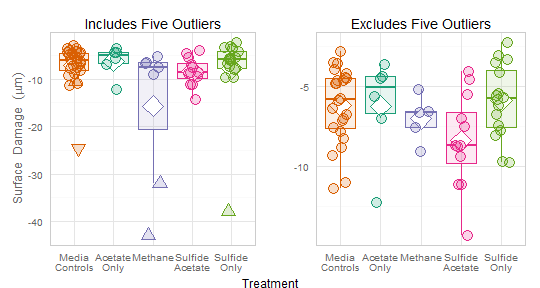

Coupon Depth
=================================================
This report summarizes the pit depths in the coupons exposed to different treatment media.

<!--  Set the working directory to the repository's base directory; this assumes the report is nested inside of only one directory. -->
<!-- Don't combine this call with any other chunk -especially one that uses file paths. -->

```r
opts_knit$set(root.dir = "../")
```


<!-- Set the report-wide options, and point to the external code file. -->

```r
require(knitr)
opts_chunk$set(results = "show", comment = NA, tidy = FALSE, dpi = 100, fig.width = 7, 
    fig.height = 4, fig.path = "figure_raw/")
# dpi = 400 out.width = '600px', #This affects only the markdown, not the
# underlying png file.  The height will be scaled appropriately.

echoChunks <- FALSE
options(width = 120)  #Widen the default text output by 50%  more characters..
read_chunk("./Analysis/CouponDepth.R")
```

<!-- Load the packages.  Suppress the output when loading packages. --> 


<!-- Load any Global functions and variables declared in the R file.  Suppress the output. --> 


<!-- Declare any global functions specific to a Rmd output.  Suppress the output. --> 


<!-- Load the datasets.   -->


<!-- Tweak the datasets.   -->

```
Warning: data length [2788] is not a sub-multiple or multiple of the number of rows [984]
Warning: Walker's alias method used: results are different from R < 2.2.0
Warning: data length [2788] is not a sub-multiple or multiple of the number of rows [246]
Warning: data length [2788] is not a sub-multiple or multiple of the number of rows [205]
Warning: data length [2788] is not a sub-multiple or multiple of the number of rows [492]
Warning: data length [2788] is not a sub-multiple or multiple of the number of rows [656]
```


## 1. Histogram Overlay
The **first graph** represents the probe heights, as a distance from the coupon's surface.  Each curve represents a histogram.  The *y* value is the depth of the probe, while the *x* indicates how much of the coupon has pits of that depth.  Th diamonds indicate a *treatement's* mean depth. The ticks on the right side indicate a *coupon's* mean depth.

The **second graph** is almost identical to the first, but with two differences.  First, each treatment has its own facet.  Second, the standard errors are shown around each treatment mean; the means and errors were estimated with a multilevel model, shown below.  

The **third graph** is identical, yet loosens the *y*-axis range so that the full depth of the pits are visible.  Consider if a coupon's maximum pit depth is a variable worth including in a formal analysis.

The five outlier coupons are *excluded* from these two graphs (*ie*, the four processed by ConocoPhillips's machine, and one suspicious control coupon).  

The diamonds/means for `AcetateOnly` and `MediaControls` are on top of each other.

   


## 2. Coupon Summary Boxplot
The first boxplot shows all points; the four coupons processed on ConocoPhillips machine are marked with a regular triangle.  Another suspicious coupon (in `MediaControls`) is marked with an upside-down triangle.  The second boxplot excludes those five coupons; notice the scale of the *y*-axis has changed.

 


## 3. Estimates from MLM (multilevel model) to Test Hypotheses
The five outlier coupons are *excluded* from these two graphs (*ie*, the four processed by ConocoPhillips's machine, and one suspicious control coupon).

Model, with treatment coefficients expressed as offsets.


```
Linear mixed model fit by REML ['lmerMod']
Formula: ProbeDepth ~ 1 + Treatment + (1 | CouponID) 
   Data: dsProbe 

REML criterion at convergence: 815751 

Random effects:
 Groups   Name        Variance Std.Dev.
 CouponID (Intercept)  6.15    2.48    
 Residual             10.36    3.22    
Number of obs: 157532, groups: CouponID, 63

Fixed effects:
                        Estimate Std. Error t value
(Intercept)              -6.2063     0.5063  -12.26
TreatmentAcetateOnly     -0.0212     1.1322   -0.02
TreatmentMethane         -0.8009     1.2194   -0.66
TreatmentSulfideAcetate  -2.1753     0.8770   -2.48
TreatmentSulfideOnly      0.3103     0.8006    0.39

Correlation of Fixed Effects:
            (Intr) TrtmAO TrtmnM TrtmSA
TrtmntActtO -0.447                     
TretmntMthn -0.415  0.186              
TrtmntSlfdA -0.577  0.258  0.240       
TrtmntSlfdO -0.632  0.283  0.263  0.365
```


Model, with treatment coefficients expressed as offsets.


|id                       |  Effect|      SE|Treatment       |TreatmentPretty  |  SELower|  SEUpper|
|:------------------------|-------:|-------:|:---------------|:----------------|--------:|--------:|
|TreatmentMediaControls   |  -6.206|  0.5063|MediaControls   |Media Controls   |   -6.713|   -5.700|
|TreatmentAcetateOnly     |  -6.222|  1.1322|AcetateOnly     |Acetate Only     |   -7.354|   -5.090|
|TreatmentMethane         |  -7.013|  1.2194|Methane         |Methane          |   -8.232|   -5.793|
|TreatmentSulfideAcetate  |  -8.383|  0.8770|SulfideAcetate  |Sulfide Acetate  |   -9.260|   -7.506|
|TreatmentSulfideOnly     |  -5.898|  0.8006|SulfideOnly     |Sulfide Only     |   -6.699|   -5.097|


## 4. Other Models (NOT to be used to Test Hypotheses)
These models are mostly to check the validity & bounds for the MLM estimates in the previous section.  Notice the point estimates for each treatment are very similar (to each other and to the previous MLM).  But the standard errors and *p*-values are very different for the 'no pooling' model, and would lead to different conclusions.  The results for the MLM and pooled


```r
### 
### This single-level model most closely resembles the reported MLM, and closely supports the MLM results.
### Instead of considering *each probe* on a coupon (which the MLM does), it considers only the mean of a coupon.
### 
mSingle <- lm(MeanDepth ~ 1 + Treatment, data=dsCoupon)
summary(mSingle)
```

```

Call:
lm(formula = MeanDepth ~ 1 + Treatment, data = dsCoupon)

Residuals:
   Min     1Q Median     3Q    Max 
 -5.99  -1.47   0.31   1.75   4.33 

Coefficients:
                        Estimate Std. Error t value Pr(>|t|)    
(Intercept)              -6.2064     0.5066  -12.25   <2e-16 ***
TreatmentAcetateOnly     -0.0155     1.1329   -0.01    0.989    
TreatmentMethane         -0.8064     1.2201   -0.66    0.511    
TreatmentSulfideAcetate  -2.1770     0.8775   -2.48    0.016 *  
TreatmentSulfideOnly      0.3084     0.8010    0.38    0.702    
---
Signif. codes:  0 '***' 0.001 '**' 0.01 '*' 0.05 '.' 0.1 ' ' 1

Residual standard error: 2.48 on 58 degrees of freedom
Multiple R-squared:  0.126,	Adjusted R-squared:  0.0656 
F-statistic: 2.09 on 4 and 58 DF,  p-value: 0.0939
```

```r

### 
### This single-level model ignores the treatment variable (and thus the model is essentially the grand-mean).
### 
mNoTreatmentSingle <- lm(MeanDepth ~ 1, data=dsCoupon)
summary(mNoTreatmentSingle)
```

```

Call:
lm(formula = MeanDepth ~ 1, data = dsCoupon)

Residuals:
   Min     1Q Median     3Q    Max 
-7.687 -1.545  0.205  2.075  4.357 

Coefficients:
            Estimate Std. Error t value Pr(>|t|)    
(Intercept)   -6.608      0.323   -20.4   <2e-16 ***
---
Signif. codes:  0 '***' 0.001 '**' 0.01 '*' 0.05 '.' 0.1 ' ' 1

Residual standard error: 2.57 on 62 degrees of freedom
```

```r

### 
### This multi-level model ignores the treatment variable (and becomes the grand-mean, but with intercepts estiamted for each coupon).
### 
mNoTreatmentMlm <- lmer(ProbeDepth ~ 1 + (1 | CouponID), data=dsProbe)
summary(mNoTreatmentMlm)
```

```
Linear mixed model fit by REML ['lmerMod']
Formula: ProbeDepth ~ 1 + (1 | CouponID) 
   Data: dsProbe 

REML criterion at convergence: 815766 

Random effects:
 Groups   Name        Variance Std.Dev.
 CouponID (Intercept)  6.58    2.57    
 Residual             10.36    3.22    
Number of obs: 157532, groups: CouponID, 63

Fixed effects:
            Estimate Std. Error t value
(Intercept)   -6.607      0.323   -20.4
```

```r
anova(m, mNoTreatmentMlm)
```

```
Data: dsProbe
Models:
mNoTreatmentMlm: ProbeDepth ~ 1 + (1 | CouponID)
m: ProbeDepth ~ 1 + Treatment + (1 | CouponID)
                Df    AIC    BIC  logLik deviance Chisq Chi Df Pr(>Chisq)  
mNoTreatmentMlm  3 815771 815801 -407883   815765                          
m                7 815771 815841 -407879   815757  8.48      4      0.076 .
---
Signif. codes:  0 '***' 0.001 '**' 0.01 '*' 0.05 '.' 0.1 ' ' 1
```

```r

### 
### For the next two models, notice the dataset changes so that each probe has its own record (not each coupon)
### This 'No Pooling' model incorrectly assumes there's no dependencies between probes on the same coupon
### The standard errors are inappropriately small (Gelman & Hill, 2007, section 12).
### 
mNoPooling <- lm(ProbeDepth ~ 1 + Treatment + CouponID, data=dsProbe)
summary(mNoPooling)
```

```

Call:
lm(formula = ProbeDepth ~ 1 + Treatment + CouponID, data = dsProbe)

Residuals:
   Min     1Q Median     3Q    Max 
-72.11  -0.77   0.31   1.49  13.00 

Coefficients: (4 not defined because of singularities)
                        Estimate Std. Error t value Pr(>|t|)    
(Intercept)              -4.6007     0.0643  -71.50  < 2e-16 ***
TreatmentAcetateOnly      0.9827     0.0910   10.80  < 2e-16 ***
TreatmentMethane         -2.0244     0.0910  -22.25  < 2e-16 ***
TreatmentSulfideAcetate  -4.0547     0.0910  -44.55  < 2e-16 ***
TreatmentSulfideOnly     -0.8072     0.0910   -8.87  < 2e-16 ***
CouponID3                -2.0378     0.0910  -22.39  < 2e-16 ***
CouponID4                 2.0766     0.0910   22.82  < 2e-16 ***
CouponID5                -2.6478     0.0910  -29.10  < 2e-16 ***
CouponID6                -4.3038     0.0910  -47.29  < 2e-16 ***
CouponID7                -1.3451     0.0910  -14.78  < 2e-16 ***
CouponID8                 1.9181     0.0910   21.08  < 2e-16 ***
CouponID9                -0.2656     0.0910   -2.92   0.0035 ** 
CouponID10               -2.3706     0.0910  -26.05  < 2e-16 ***
CouponID11                3.1561     0.0910   34.67  < 2e-16 ***
CouponID12                2.3195     0.0910   25.49  < 2e-16 ***
CouponID13               -0.4079     0.0910   -4.48  7.4e-06 ***
CouponID14               -0.7623     0.0910   -8.38  < 2e-16 ***
CouponID15               -4.2257     0.0910  -46.42  < 2e-16 ***
CouponID16               -0.1818     0.0910   -2.00   0.0457 *  
CouponID17                1.2685     0.0910   13.94  < 2e-16 ***
CouponID19               -2.4507     0.0910  -26.92  < 2e-16 ***
CouponID20                1.4252     0.0910   15.66  < 2e-16 ***
CouponID22               -0.9300     0.0910  -10.22  < 2e-16 ***
CouponID23                0.0448     0.0910    0.49   0.6224    
CouponID24                    NA         NA      NA       NA    
CouponID25               -8.5904     0.0910  -94.41  < 2e-16 ***
CouponID26               -0.7378     0.0910   -8.11  5.1e-16 ***
CouponID27               -3.3976     0.0910  -37.35  < 2e-16 ***
CouponID28               -0.8824     0.0910   -9.70  < 2e-16 ***
CouponID29               -2.0484     0.0909  -22.52  < 2e-16 ***
CouponID30                    NA         NA      NA       NA    
CouponID31                3.1817     0.0910   34.96  < 2e-16 ***
CouponID32                1.1701     0.0910   12.86  < 2e-16 ***
CouponID33               -2.4718     0.0910  -27.16  < 2e-16 ***
CouponID34               -0.0862     0.0910   -0.95   0.3436    
CouponID35               -2.4531     0.0910  -26.96  < 2e-16 ***
CouponID36               -0.7181     0.0910   -7.89  3.0e-15 ***
CouponID37                4.0869     0.0910   44.90  < 2e-16 ***
CouponID38                1.6283     0.0910   17.89  < 2e-16 ***
CouponID39                4.5974     0.0910   50.51  < 2e-16 ***
CouponID40               -0.0260     0.0910   -0.29   0.7748    
CouponID41               -5.6243     0.0910  -61.79  < 2e-16 ***
CouponID42                    NA         NA      NA       NA    
CouponID44               -1.7969     0.0910  -19.74  < 2e-16 ***
CouponID45               -2.5554     0.0910  -28.08  < 2e-16 ***
CouponID46               -0.2122     0.0910   -2.33   0.0198 *  
CouponID47               -0.0621     0.0910   -0.68   0.4952    
CouponID48                1.7600     0.0910   19.34  < 2e-16 ***
CouponID49                1.0520     0.0910   11.56  < 2e-16 ***
CouponID51               -0.1914     0.0910   -2.10   0.0355 *  
CouponID52               -3.6598     0.0910  -40.21  < 2e-16 ***
CouponID53               -4.6908     0.0910  -51.53  < 2e-16 ***
CouponID54               -4.2368     0.0910  -46.55  < 2e-16 ***
CouponID55               -1.2729     0.0910  -13.99  < 2e-16 ***
CouponID56               -2.1709     0.0910  -23.85  < 2e-16 ***
CouponID57                1.0347     0.0910   11.37  < 2e-16 ***
CouponID58                0.1487     0.0910    1.63   0.1022    
CouponID59               -2.3822     0.0910  -26.17  < 2e-16 ***
CouponID60               -1.1232     0.0910  -12.34  < 2e-16 ***
CouponID61               -6.3800     0.0910  -70.10  < 2e-16 ***
CouponID62                0.1112     0.0910    1.22   0.2217    
CouponID63                0.6573     0.0910    7.22  5.0e-13 ***
CouponID64                0.3976     0.0910    4.37  1.3e-05 ***
CouponID65               -2.9697     0.0910  -32.62  < 2e-16 ***
CouponID66               -6.7927     0.0910  -74.65  < 2e-16 ***
CouponID67               -3.1990     0.0910  -35.15  < 2e-16 ***
CouponID68                    NA         NA      NA       NA    
---
Signif. codes:  0 '***' 0.001 '**' 0.01 '*' 0.05 '.' 0.1 ' ' 1

Residual standard error: 3.22 on 157469 degrees of freedom
Multiple R-squared:  0.385,	Adjusted R-squared:  0.385 
F-statistic: 1.59e+03 on 62 and 157469 DF,  p-value: <2e-16
```

```r

###
### This 'Complete Pooling' model ignores any variabtion in depths between coupons (Gelman & Hill, 2007, subsection 12.3).
###
mCompletePooling <- lm(ProbeDepth ~ 1 + Treatment, data=dsProbe)
summary(mCompletePooling)
```

```

Call:
lm(formula = ProbeDepth ~ 1 + Treatment, data = dsProbe)

Residuals:
   Min     1Q Median     3Q    Max 
-73.10  -1.58   0.83   2.61   8.06 

Coefficients:
                        Estimate Std. Error t value Pr(>|t|)    
(Intercept)              -6.2060     0.0163 -379.86   <2e-16 ***
TreatmentAcetateOnly     -0.0203     0.0365   -0.55     0.58    
TreatmentMethane         -0.8009     0.0393  -20.35   <2e-16 ***
TreatmentSulfideAcetate  -2.1754     0.0283  -76.88   <2e-16 ***
TreatmentSulfideOnly      0.3102     0.0258   12.01   <2e-16 ***
---
Signif. codes:  0 '***' 0.001 '**' 0.01 '*' 0.05 '.' 0.1 ' ' 1

Residual standard error: 4 on 157527 degrees of freedom
Multiple R-squared:  0.0485,	Adjusted R-squared:  0.0484 
F-statistic: 2.01e+03 on 4 and 157527 DF,  p-value: <2e-16
```

```r
anova(mCompletePooling, mNoPooling)
```

```
Analysis of Variance Table

Model 1: ProbeDepth ~ 1 + Treatment
Model 2: ProbeDepth ~ 1 + Treatment + CouponID
  Res.Df     RSS Df Sum of Sq    F Pr(>F)    
1 157527 2523094                             
2 157469 1630792 58    892301 1486 <2e-16 ***
---
Signif. codes:  0 '***' 0.001 '**' 0.01 '*' 0.05 '.' 0.1 ' ' 1
```


## Session Information
For the sake of documentation and reproducibility, the current report was build on a system using the following software.


```
Report created by Will at 2014-02-14, 21:40:31 -0600
```

```
R Under development (unstable) (2014-02-10 r64961)
Platform: x86_64-w64-mingw32/x64 (64-bit)

locale:
[1] LC_COLLATE=English_United States.1252  LC_CTYPE=English_United States.1252    LC_MONETARY=English_United States.1252
[4] LC_NUMERIC=C                           LC_TIME=English_United States.1252    

attached base packages:
[1] grid      stats     graphics  grDevices utils     datasets  methods   base     

other attached packages:
 [1] arm_1.6-10         MASS_7.3-29        lme4_1.0-6         Matrix_1.1-0       lattice_0.20-24    boot_1.3-9        
 [7] ggplot2_0.9.3.1    gridExtra_0.9.1    plyr_1.8.0.99      RColorBrewer_1.0-5 testit_0.3         knitr_1.5         

loaded via a namespace (and not attached):
 [1] abind_1.4-0      coda_0.16-1      colorspace_1.2-4 dichromat_2.0-0  digest_0.6.4     evaluate_0.5.1  
 [7] formatR_0.10     gtable_0.1.2     labeling_0.2     minqa_1.2.3      munsell_0.4.2    nlme_3.1-113    
[13] proto_0.3-10     Rcpp_0.11.0      reshape2_1.2.2   scales_0.2.3     splines_3.1.0    stringr_0.6.2   
[19] tools_3.1.0     
```

