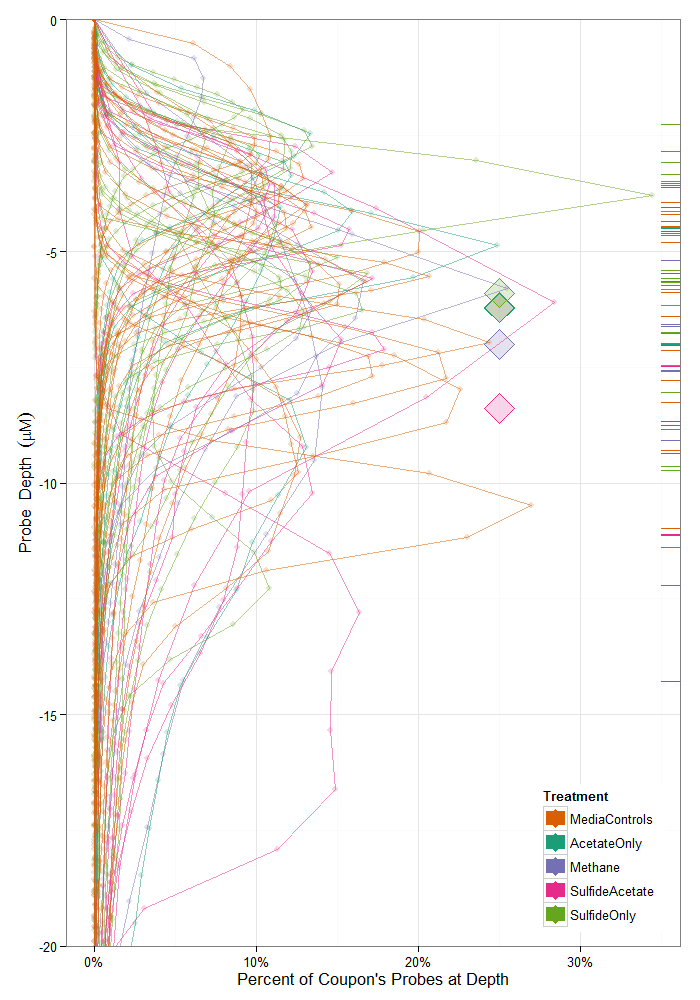

SMPY Descriptives
=================================================
This report summarizes the NLSY79 Gen1 variables that correspond to the health items in the SMPY.

<!--  Set the working directory to the repository's base directory; this assumes the report is nested inside of only one directory.-->

```r
# cat('Working directory: ', getwd())

# if( basename(getwd()) == 'Analysis' ) {
opts_knit$set(root.dir = "../")  #Don't combine this call with any other chunk -especially one that uses file paths.
# }
```


<!-- Set the report-wide options, and point to the external code file. -->

```r
# pathInput <- './Data/Raw/CouponPitDepth.csv' ds <- read.csv(pathInput,
# stringsAsFactors=FALSE) str(ds)

cat("Working directory: ", getwd())
```

```
## Working directory:  D:/Users/Will/Documents/GitHub/LylesCarbonSteelCorrosion
```

```r
require(knitr)
opts_chunk$set(results = "show", comment = NA, tidy = FALSE, dpi = 100, fig.width = 6.5, 
    fig.height = 4, fig.path = "figure_raw/")
# dev = 'png'#, dpi = 400 dpi = 100 out.width = '600px', #This affects only
# the markdown, not the underlying png file.  The height will be scaled
# appropriately.

echoChunks <- FALSE
options(width = 120)  #So the output is 50% wider than the default.
read_chunk("./Analysis/CouponHeight.R")
```

<!-- Load the packages.  Suppress the output when loading packages. --> 


<!-- Load any Global functions and variables declared in the R file.  Suppress the output. --> 


<!-- Declare any global functions specific to a Rmd output.  Suppress the output. --> 


<!-- Load the datasets.   -->


<!-- Tweak the datasets.   -->

```
Linear mixed model fit by REML ['lmerMod']
Formula: ProbeHeight ~ 1 + Treatment + (1 | CouponID) 
   Data: dsProbe 

REML criterion at convergence: 917145 

Random effects:
 Groups   Name        Variance Std.Dev.
 CouponID (Intercept) 48.3     6.95    
 Residual             12.8     3.58    
Number of obs: 170029, groups: CouponID, 68

Fixed effects:
                        Estimate Std. Error t value
(Intercept)                6.227      2.836    2.20
TreatmentMediaControls     0.847      3.147    0.27
TreatmentMethane           9.476      3.865    2.45
TreatmentSulfideAcetate    2.154      3.474    0.62
TreatmentSulfideOnly       1.552      3.299    0.47

Correlation of Fixed Effects:
            (Intr) TrtmMC TrtmnM TrtmSA
TrtmntMdCnt -0.901                     
TretmntMthn -0.734  0.661              
TrtmntSlfdA -0.816  0.736  0.599       
TrtmntSlfdO -0.860  0.775  0.631  0.702
```


## 1. Histogram Overlay
  


## 2. Coupon Summary Boxplot
 


## Session Information
For the sake of documentation and reproducibility, the current report was build on a system using the following software.


```
Report created by Will at 2014-02-13, 00:03:20 -0600
```

```
R Under development (unstable) (2014-02-10 r64961)
Platform: x86_64-w64-mingw32/x64 (64-bit)

locale:
[1] LC_COLLATE=English_United States.1252  LC_CTYPE=English_United States.1252    LC_MONETARY=English_United States.1252
[4] LC_NUMERIC=C                           LC_TIME=English_United States.1252    

attached base packages:
[1] stats     graphics  grDevices utils     datasets  methods   base     

other attached packages:
 [1] lme4_1.0-6      Matrix_1.1-0    lattice_0.20-24 boot_1.3-9      quantreg_5.05   SparseM_1.03    ggplot2_0.9.3.1
 [8] plyr_1.8.0.99   RODBC_1.3-10    knitr_1.5      

loaded via a namespace (and not attached):
 [1] abind_1.4-0        arm_1.6-10         coda_0.16-1        colorspace_1.2-4   dichromat_2.0-0    digest_0.6.4      
 [7] evaluate_0.5.1     formatR_0.10       grid_3.1.0         gtable_0.1.2       labeling_0.2       MASS_7.3-29       
[13] minqa_1.2.3        munsell_0.4.2      nlme_3.1-113       proto_0.3-10       RColorBrewer_1.0-5 Rcpp_0.11.0       
[19] reshape2_1.2.2     scales_0.2.3       splines_3.1.0      stringr_0.6.2      tools_3.1.0       
```

