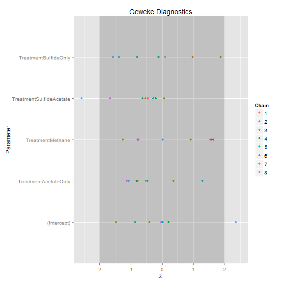

<!-- Specify the report's official name, goal & description. -->
# Diagnosis of Coupon Pit Depth

**Report Description**: This report is more for the diagnosis of the MCMC.  The `CouponDepth` report is intended for general audiences.


<!-- Point knitr to the underlying code file so it knows where to look for the chunks. -->


<!-- Load the packages.  Suppress the output when loading packages. --> 


<!-- Load any Global Functions declared in the R file.  Suppress the output. --> 


<!-- Declare any global functions specific to a Rmd output.  Suppress the output. --> 


<!-- Load the dataset.   -->


<!-- Tweak the dataset.   -->


<!-- Prepare the parameters to be sent to the MCMC.   -->


## 1. Parameters
**chainCount**: 4

**iterationCount**: 1000 (The number used for estimate -ie, it doesn't include burn-in.)

**burninCount**: 250


## 2. MCMCglmm


```

                      MCMC iteration = 0

                      MCMC iteration = 1000

                      MCMC iteration = 0

                      MCMC iteration = 1000

                      MCMC iteration = 0

                      MCMC iteration = 1000

                      MCMC iteration = 0

                      MCMC iteration = 1000
```

```
Time difference of 2.509 mins
```

```

 Iterations = 251:1000
 Thinning interval  = 1
 Sample size  = 750 

 DIC: 815367 

 G-structure:  ~CouponID

         post.mean l-95% CI u-95% CI eff.samp
CouponID      6.35     4.26     8.61      601

 R-structure:  ~units

      post.mean l-95% CI u-95% CI eff.samp
units      10.4     10.3     10.4      750

 Location effects: ProbeDepth ~ 1 + Treatment 

                        post.mean l-95% CI u-95% CI eff.samp  pMCMC   
(Intercept)               -6.1928  -7.1613  -5.1435      750 <0.001 **
TreatmentAcetateOnly      -0.0329  -2.3283   2.1307      750  0.973   
TreatmentMethane          -0.8871  -3.6244   1.4970      750  0.509   
TreatmentSulfideAcetate   -2.1877  -4.2826  -0.6954      750  0.035 * 
TreatmentSulfideOnly       0.2686  -1.2866   1.8113      750  0.709   
---
Signif. codes:  0 '***' 0.001 '**' 0.01 '*' 0.05 '.' 0.1 ' ' 1
```

```

Iterations = 251:1000
Thinning interval = 1 
Number of chains = 4 
Sample size per chain = 750 

1. Empirical mean and standard deviation for each variable,
   plus standard error of the mean:

                           Mean    SD Naive SE Time-series SE
(Intercept)             -6.1960 0.515   0.0094        0.00956
TreatmentAcetateOnly    -0.0349 1.138   0.0208        0.02026
TreatmentMethane        -0.8303 1.239   0.0226        0.02261
TreatmentSulfideAcetate -2.1876 0.902   0.0165        0.01722
TreatmentSulfideOnly     0.3032 0.814   0.0149        0.01486

2. Quantiles for each variable:

                         2.5% 15.87%    25%     50%     75% 84.13%  97.5%
(Intercept)             -7.22 -6.697 -6.530 -6.2021 -5.8677 -5.707 -5.169
TreatmentAcetateOnly    -2.32 -1.142 -0.787 -0.0564  0.7316  1.096  2.174
TreatmentMethane        -3.29 -2.070 -1.643 -0.8215 -0.0177  0.395  1.659
TreatmentSulfideAcetate -3.95 -3.088 -2.780 -2.1787 -1.5934 -1.307 -0.407
TreatmentSulfideOnly    -1.29 -0.514 -0.262  0.3076  0.8405  1.112  1.900
```

```
R-Hat:
```

```
Potential scale reduction factors:

                        Point est. Upper C.I.
(Intercept)                      1          1
TreatmentAcetateOnly             1          1
TreatmentMethane                 1          1
TreatmentSulfideAcetate          1          1
TreatmentSulfideOnly             1          1

Multivariate psrf

1
```

 

```
Effective Size:
```

```
            (Intercept)    TreatmentAcetateOnly        TreatmentMethane TreatmentSulfideAcetate    TreatmentSulfideOnly 
                   2909                    3180                    3000                    2758                    3000 
```


### For and explanation of the graphs, see http://xavier-fim.net/packages/ggmcmc/

```
Error: subscript out of bounds
```

```
Error: subscript out of bounds
```

 

```
Error: subscript out of bounds
```

 


```
Warning: Removed 12 rows containing missing values (geom_point).
```

    


## 3. Display Syntax of Models


```
function( x ) {
  MCMCglmm(fixed = ProbeDepth ~ 1 + Treatment,
           random = ~ CouponID,
           data = dsProbe, 
           nitt = iterationCount,
           burnin = burninCount,
           thin = thinCount)
}
```


## --Session Info--

```
Report created by Will at 2014-02-15, 00:36:58 -0600
```

```
R Under development (unstable) (2014-02-10 r64961)
Platform: x86_64-w64-mingw32/x64 (64-bit)

locale:
[1] LC_COLLATE=English_United States.1252  LC_CTYPE=English_United States.1252    LC_MONETARY=English_United States.1252
[4] LC_NUMERIC=C                           LC_TIME=English_United States.1252    

attached base packages:
[1] stats     graphics  grDevices utils     datasets  methods   base     

other attached packages:
 [1] ggmcmc_0.5.1    ggplot2_0.9.3.1 reshape2_1.2.2  plyr_1.8.0.99   MCMCglmm_2.17   corpcor_1.6.6   ape_3.0-11      Matrix_1.1-0    tensorA_0.36   
[10] coda_0.16-1     lattice_0.20-24 knitr_1.5      

loaded via a namespace (and not attached):
 [1] colorspace_1.2-4   dichromat_2.0-0    digest_0.6.4       evaluate_0.5.1     formatR_0.10       grid_3.1.0         gtable_0.1.2      
 [8] labeling_0.2       MASS_7.3-29        munsell_0.4.2      nlme_3.1-113       proto_0.3-10       RColorBrewer_1.0-5 Rcpp_0.11.0       
[15] scales_0.2.3       stringr_0.6.2      tools_3.1.0       
```

