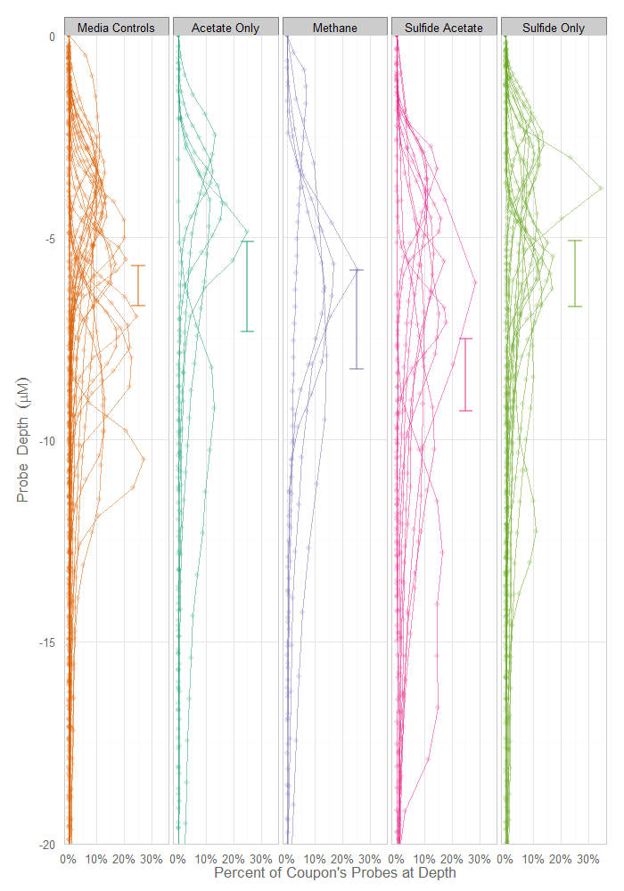
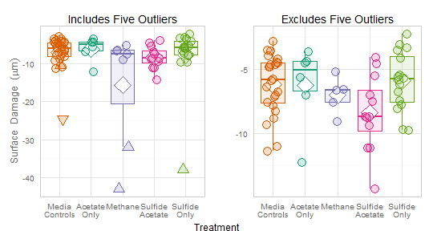

Welcome to the code repository for the [article](http://journal.frontiersin.org/Journal/10.3389/fmicb.2014.00114/):

Anaerobic hydrocarbon and fatty acid metabolism by syntrophic bacteria and their impact on carbon steel corrosion
=========================

Christopher N. Lyles [1](http://biocorrosioncenter.ou.edu/), 
Huynh M. Le [1](http://biocorrosioncenter.ou.edu/), 
[William H. Beasley](http://scholar.google.com/citations?user=ffsJTC0AAAAJ&hl=en) [2](http://howardliveoak.com/), 
[Michael J. McInerney](http://scholar.google.com/citations?user=M13EdqIAAAAJ&hl=en&oi=sra) [1](http://biocorrosioncenter.ou.edu/) and
Joseph M. Suflita [1](http://biocorrosioncenter.ou.edu/) 
(2014). *[Anaerobic hydrocarbon and fatty acid metabolism by syntrophic bacteria and their impact on carbon steel corrosion.](http://journal.frontiersin.org/Journal/10.3389/fmicb.2014.00114/)* Frontiers in Microbiology 5:114. doi: 10.3389/fmicb.2014.00114.

Organization 1: [Department of Microbiology and Plant Biology](http://mpbio.ou.edu/), [Institute for Energy and the Environment](http://vpr-norman.ou.edu/centers-institutes/list/ou-institute-energy-and-environment), and the [OU Biocorrosion Center](http://biocorrosioncenter.ou.edu/), [University of Oklahoma](http://www.ou.edu/), Norman, OK, USA; Organization 2: [Howard Live Oak, LLC](http://howardliveoak.com/), USA

## Article Abstract
> The microbial metabolism of hydrocarbons is increasingly associated with the corrosion of carbon steel in sulfate-rich marine waters. However, how such transformations influence metal biocorrosion in the absence of an electron acceptor is not fully recognized. We grew a marine alkane-utilizing, sulfate-reducing bacterium, Desulfoglaeba alkanexedens, with either sulfate or Methanospirillum hungatei as electron acceptors, and tested the ability of the cultures to catalyze metal corrosion. Axenically, D. alkanexedens had a higher instantaneous corrosion rate and produced more pits in carbon steel coupons than when the same organism was grown in syntrophic co-culture with the methanogen. Since anaerobic hydrocarbon biodegradation pathways converge on fatty acid intermediates, the corrosive ability of a known fatty acid-oxidizing syntrophic bacterium, Syntrophus aciditrophicus was compared when grown in pure culture or in co-culture with a H2-utilizing sulfate-reducing bacterium (Desulfovibrio sp., strain G11) or a methanogen (M. hungatei). The instantaneous corrosion rates in the cultures were not substantially different, but the syntrophic, sulfate-reducing co-culture produced more pits in coupons than other combinations of microorganisms. Lactate-grown cultures of strain G11 had higher instantaneous corrosion rates and coupon pitting compared to the same organism cultured with hydrogen as an electron donor. Thus, if sulfate is available as an electron acceptor, the same microbial assemblages produce sulfide and low molecular weight organic acids that exacerbated biocorrosion. Despite these trends, a surprisingly high degree of variation was encountered with the corrosion assessments. Differences in biomass, initial substrate concentration, rates of microbial activity or the degree of end product formation did not account for the variations. We are forced to ascribe such differences to the metallurgical properties of the coupons.

> Keywords: syntrophy, biocorrosion, microbiologically influenced corrosion (MIC), hydrocarbon degradation, fatty acid oxidation

## Selected Figures from Manuscript
The following two figures can be reproduced from the datasets and analytical code in this repository. These are low-resolution versions; the high-resolution versions can be found in the [article](http://journal.frontiersin.org/Journal/10.3389/fmicb.2014.00114/abstract#sthash.blZy7pCT.dpuf) or in the [`figure_publication`](./Analysis/figure_publication) directory.

#### Figure 7

#### Figure S21

## Reproducible Research
When the repository is installed on your local machine, and the [R](http://cran.rstudio.com/) software is installed, the [`Reproduce.R`](./UtilityScripts/Reproduce.R) script starts with our [initial datasets](./Data/Raw/CouponPitDepth.csv) (ie, coupon pit depths) to create the derivative datasets and [resulting graphs and analysis](./Analysis/CouponDepth.html) comparison of pit depths.

## Directories
The following directories are part of the repository:
 * `Datasets/Raw`: CSV versions of the initial dataset.  It is readable from GitHub, or any text editor.
 * `Datasets/Raw`: RDS versions of the derivative dataset.  It is readable only from [R](http://cran.rstudio.com/).
 * `Code`: The [data manipulation code](./Code/AugmentData.R) and [analytical code](./Code/EstimateMlmMcmc/EstimateMlmMcmc.R) that compares pit depths across groups.  It also contains the [techinical output](/Code/EstimateMlmMcmc/EstimateMlmMcmc.html) from the multilevel model, estimated with an MCMC in [MCMCglmm](http://cran.r-project.org/web/packages/MCMCglmm/index.html).
 * `Analysis`: The analytical code and [report](/Analysis/CouponDepth.html) that places the MCMC results into the context of microbiology.
 * `Documentation/ImagesFromLab`: Images used to within our team's internal communication.  Also make sure to see all the images in the article's [supplementary material](http://www.frontiersin.org/journal/10.3389/fmicb.2014.
00114/abstract).
 * `UtilityScripts`: R scripts that help automate certain tasks, including reproducing the analysis and figures in this repository.
